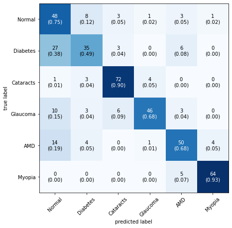
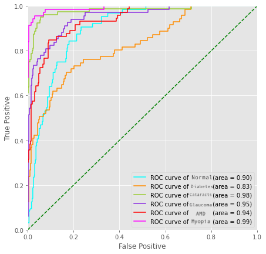
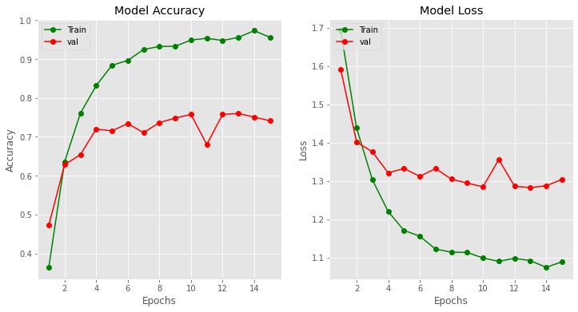
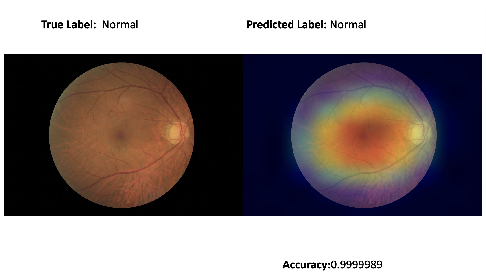
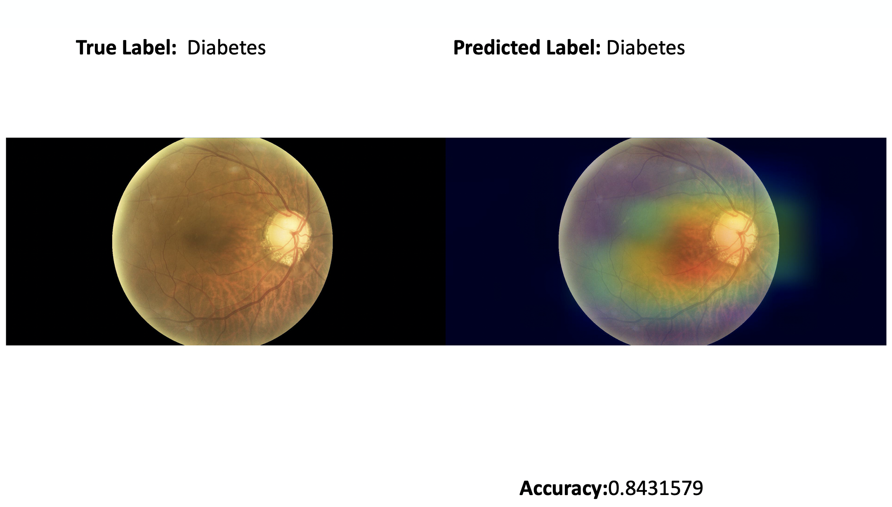
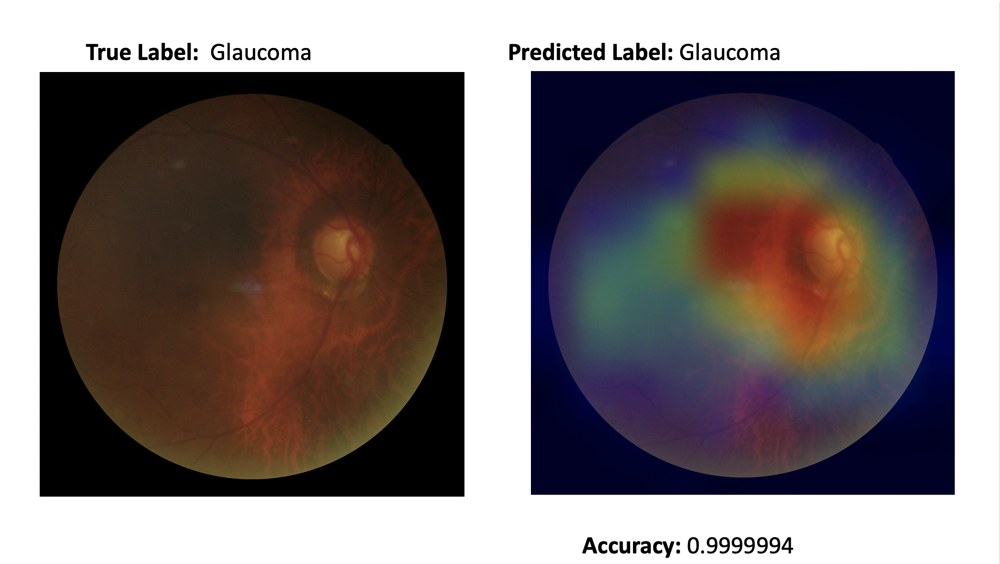
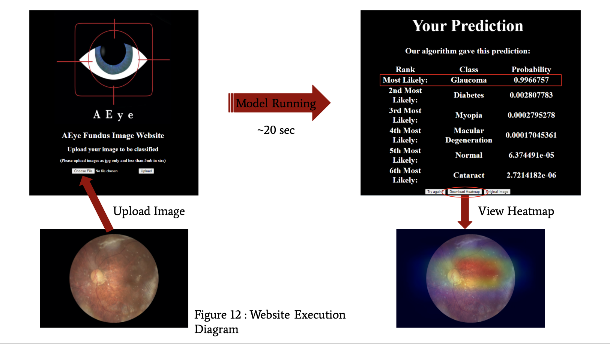

# Introduction 
Multi-class image classifer for Fundus Opthamologic Medical Imagings

Detects the following disease:
* Normal
* Diabetic Retinopathy 
* Cataract
* Glaucoma
* Age Related Macular Degeneration
* Patholical Myopia
#### Accuracy = .74

### Confusion Matrix 


### ROC 


### Model Accuracy and Loss



# Using model 

```python

from keras.models import Model, load_model
model= load_model(PATH/model.h5)
```

# How to Run and Train Model Locally 

Download Jupyter Notebooks, Anaconda, Python 3 

https://jupyter.org/install

https://www.anaconda.com/products/individual

https://www.python.org/downloads/

Have the following Python Libraries Installed
* numpy 
* pandas 
* cv2
* matplotlib
* Tensorflow
* Keras 
* IPython 
* PIL 
* sklearn
* itertools

The model was trained and created in AWS Sagemaker. Please note comments to make changes to run locally. 

## Examples of GradCam Images 

### Normal Image 


### Diabetic Retinopathy Image


### Glaucoma Image 



# Website 


# Data

 Source | Diease 
  --- | --- 
 | https://www.kaggle.com/jr2ngb/cataractdataset | Cataracts, Glaucoma |
 | https://www.kaggle.com/linchundan/fundusimage1000 | Myopia, AMD |
 | https://www.kaggle.com/nguyenhung1903/diaretdb1-v21 | Diabetic Retinopathy |
 | http://www5.informatik.uni-erlangen.de/research/data/fundus-images/ | Diabetic Retinopathy, Glaucoma |
 | https://www.it.lut.fi/project/imageret/diaretdb0/#DOWNLOAD | Diabetic Retinopathy |
 | https://personalpages.manchester.ac.uk/staff/niall.p.mcloughlin/ | Glaucoma, Diabetic Retinopathy, AMD|
 | https://ai.baidu.com/broad/download | AMD, Glaucoma, Myopia | 
 |https://www.kaggle.com/andrewmvd/ocular-disease-recognition-odir5k|Diabetic Retinopathy, Normal, Cataract, Glaucoma, AMD, Myopia|
 
 


######  Logo Design- Jody Serani


  
  
  
